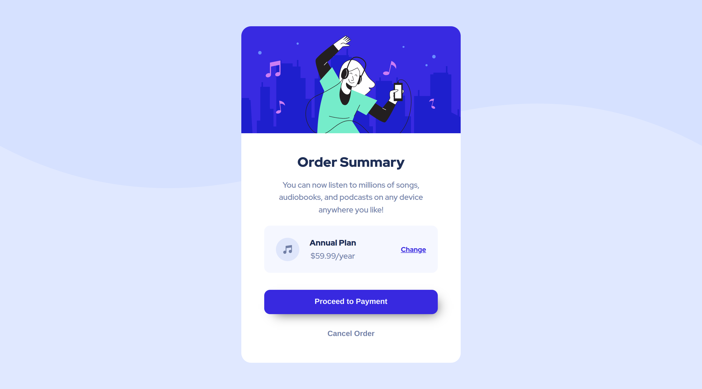

# Frontend Mentor - Order summary card solution

This is a solution to the [Order summary card challenge on Frontend Mentor](https://www.frontendmentor.io/challenges/order-summary-component-QlPmajDUj).

## Table of contents

- [Overview](#overview)
  - [The challenge](#the-challenge)
  - [Screenshot](#screenshot)
  - [Links](#links)
- [My process](#my-process)
  - [Built with](#built-with)
  - [What I learned](#what-i-learned)
  - [Continued development](#continued-development)
  - [Useful resources](#useful-resources)
- [Author](#author)

## Overview

### The challenge

Users should be able to:

- See hover states for interactive elements

### Screenshot

#### Desktop

#### Desktop (active states)

#### Cellphone (~375 pixels width)

### Links

- Live Site URL: [https://oczywsziysya.github.io/fem-order-summary-card](https://oczywsziysya.github.io/fem-order-summary-card)

## My process

### Built with

- Semantic HTML5 markup
- CSS custom properties
- Flexbox

### What I learned

I read some articles about modern CSS features that are well supported on modern browsers and learned about a few things, like nested selectors to improve readability, media-queries inside selectors (which is close to what I've been doing for the last few projects, wish I knew that was possible before), and finally learned to use the clamp() function for fluid layouts and typography and now I understand why some people consider it to be such a game changer, it's just much better than creating a lot of media-queries. For this project in specific, I used it mainly for paddings and typography and it scales so much better, there are no font-size jumps, and the code is much more concise and clean. 

### Continued development

* Write semantically correct HTML.
* Write clean and concise CSS code.
* Learn more about techniques for making truly fluid layouts that scale much better.
* Learn about container-queries and when should they be used instead of media-queries.

### Useful resources

- [Fluid vs. responsive typography with CSS clamp on LogRocket](https://blog.logrocket.com/fluid-vs-responsive-typography-css-clamp/)
- ["min(), max(), and clamp() are CSS magic!" by Kevin Powell](https://www.youtube.com/watch?v=U9VF-4euyRo&ab_channel=KevinPowell)
- [Native CSS Nesting on LogRocket](https://blog.logrocket.com/native-css-nesting/)
- [Modern CSS for 2024 on Builder.io](https://www.builder.io/blog/css-2024-nesting-layers-container-queries)

## Author

- Frontend Mentor - [@Oczywsziysya](https://www.frontendmentor.io/profile/Oczywsziysya)
